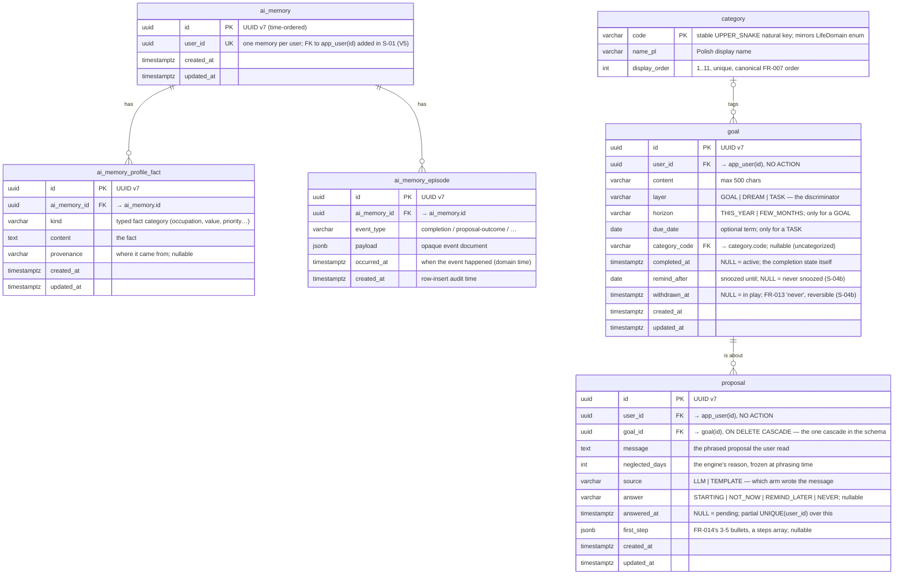

# Data Model

Living data-model doc for 2do AI. Designed **before** the migration that implements
it (design-first). Future slices extend this file as they add tables. Schema is owned
by **Flyway** (`backend/src/main/resources/db/migration`); Hibernate runs
`ddl-auto=validate` and never alters it.

## Entity-Relationship Diagram

`category` is the reference table from the persistence baseline (F-01). It is **reference
data** — the 11 fixed life domains (FR-007), seeded by migration and never edited at
runtime in the MVP. It uses a stable natural key (`code`) rather than a surrogate PK
because the code is the identity the AI auto-tag layer (FR-008) classifies into.

The **AI-memory aggregate** (F-02, Flyway `V3`) is the first domain aggregate, so it is
also the first use of the UUID v7 surrogate-PK + `timestamptz` audit-column conventions
below. `ai_memory` is the root (one row per user); it owns a **semantic profile**
(`ai_memory_profile_fact` — durable typed facts) and a bounded **episodic log**
(`ai_memory_episode` — completions and proposal outcomes, generic `event_type` + `jsonb`
payload). Both layers are rendered and injected into the proposal prompt (S-04); episodic
rows are never deleted (the "last N" cap is a render-time concern), which also leaves them
as the seam for a post-MVP RAG extension.

> **FK (realized in S-01):** `ai_memory.user_id` was an unconstrained, unique UUID column
> in F-02 (`V3`); **S-01** (`account-and-auth`) creates the `app_user` table (`V4`) and adds
> the FK `ai_memory.user_id → app_user(id)` via an expand-only `ALTER` (`V5`). The table is
> `app_user`, not `user` — `user` is a reserved word in Postgres. There is **no
> `ON DELETE CASCADE`**: FR-019 account deletion is app-orchestrated, and the plain FK is the
> DB backstop that makes an out-of-order delete fail loudly. The `UNIQUE` constraint still
> enforces one memory per user.

**`goal`** (S-02, Flyway `V6`; widened by S-07 in `V7` and by S-04b in `V8`) holds **all three** layers — long-term
goals (FR-004), someday dreams (FR-005) and current tasks (FR-003) — in one table,
discriminated by `layer`. One aggregate rather than parallel tables was decided on 2026-08-17
and extended on 2026-08-24: S-04/S-05/S-08/S-09/S-10 all consume the union, and nothing but the
two time fields differs. Which one an entry may carry follows from its layer —

| layer   | `horizon` | `due_date` |
| ------- | --------- | ---------- |
| `GOAL`  | required  | forbidden  |
| `DREAM` | forbidden | forbidden  |
| `TASK`  | forbidden | optional   |

— and that one rule is enforced at three depths: the request DTOs (→ 422), the aggregate
constructor, and the DB constraint `chk_goal_layer_time_fields`, widened and renamed in `V7` and bypassable by
no future writer. Splitting a `task` aggregate out waits until tasks get a different lifecycle
(recurrence, overdue alarms); it would then be a migration, not a rewrite. `completed_at` **is** the
completion state (null = active); a timestamp rather than a boolean because S-03's memory
enrichment needs to know when, not merely whether. `category_code` is nullable: an entry may
stay uncategorized, and S-09's auto-tag only ever fills it in. Like `ai_memory.user_id`, the
FK to `app_user` is deliberately **not** `ON DELETE CASCADE` — FR-019 deletion is
app-orchestrated (`GoalDataDeleter`) and the plain FK is the backstop.

S-04b (`V8`) adds the two columns above and the **`proposal`** table. The split between them is
the whole reason `proposal` is its own aggregate rather than more columns on `goal`: `ProposalSelector`
reads `goal.updated_at` as *"when the user last engaged with this"*, so anything the machine writes on
its own — the phrased message, the frozen `neglected_days`, the generated `first_step` — would silently
reset the neglect clock if it landed there. It lives on `proposal` instead. `remind_after` and
`withdrawn_at` are the exceptions that prove the rule: a snooze and a withdrawal are things the *user*
asked for, so stamping the `goal` row is honest.

Two schema decisions carry product rules that a service check could not:

- **FR-018 (at most one pending proposal) is a partial unique index**, `idx_proposal_one_pending ON
  proposal (user_id) WHERE answered_at IS NULL`. A service-level "does this user already have one?"
  races with itself on a double-click and stores both; the index cannot. Answered rows accumulate
  freely — only the pending slot is exclusive.
- **`proposal.goal_id` is the one `ON DELETE CASCADE` in this schema**, so `DELETE /api/goals/{id}`
  keeps working while a proposal points at the entry. The cost is named rather than hidden: because
  `GoalDataDeleter` runs during FR-019 account deletion and every proposal has a goal, the cascade
  erases a user's proposals *before* `ProposalDataDeleter` is reached — so the "a missing deleter
  fails loudly on the FK" property does **not** protect this table. The deleter exists anyway, and
  becomes load-bearing the moment a proposal can outlive its entry.

`remind_after` is a `DATE` compared against the user's local date, exactly as `due_date` already is:
a snooze is "come back on Thursday", not a moment in a timezone. `first_step` follows
`ai_memory_episode.payload` — `jsonb` mapped from a raw JSON `String`, which keeps the entity free of
any Jackson coupling.

### Internationalization

The **language-neutral identity is `code`**, never the label. All domain and AI logic
keys off `code` (= the `LifeDomain` enum) and `display_order`; `name_pl` is *purely a
display label* that nothing functional reads. The explicit `_pl` suffix documents the
locale assumption rather than hiding it behind a bare `name`.

The MVP is Polish-only (single user), so we store one label and stop there (YAGNI).
Adding a language later never touches identity or behavior and is always **expand-only**
(backward-compatible). When a second language is genuinely needed, pick by how many
locales we expect to support:

- **A few fixed languages (PL + EN):** add a `name_en` column — one expand-only
  migration, no joins.
- **Many/growing locales, or a translator workflow:** add a
  `category_translation(category_code, locale, name)` table (locales become data, not
  schema).
- **Adopting i18n tooling anyway:** move labels out of the DB into message catalogs
  keyed by `code`; the table then keeps only `code` + `display_order`. Arguably the
  cleanest for pure display strings.

Because `code` is the identity, any of these is reachable without a destructive
migration.

## Conventions

Every later slice inherits these rules (also recorded in `CLAUDE.md`):

- **Domain aggregates** (User, Goal — one aggregate covering the goal, dream and task layers,
  CurrentTask, AI-memory, …) use a **UUID v7**
  surrogate primary key, generated via Hibernate `@UuidGenerator`
  (RFC 9562, `UuidVersion7Strategy` — time-ordered, index-friendly).
- **Audit columns**: every domain table carries `created_at` and `updated_at` of type
  `timestamptz`.
- **Reference tables** (like `category`) may instead use a **stable natural key** and
  omit audit columns, since the data is static and versioned by migration.
- **Columns are `snake_case`**; Java fields map to them (`name_pl` ↔ `namePl`).
- **Migrations are expand-only** in spirit (backward-compatible create/insert), so an
  image rollback never strands the schema. Destructive changes follow expand/contract.

## Planned (not yet designed)

No table is currently waiting to be designed. Later slices add theirs here; each will
reference `category.code` where it needs a life domain.

> The AI-memory tables (`ai_memory`, `ai_memory_profile_fact`, `ai_memory_episode`) were
> in this list until F-02; they are now drawn above. So was **`app_user`**, until S-01
> shipped it in `V4`/`V5`. So were **`goal`** and **`dream`**, listed as two tables before
> the schema was designed — S-02 settled on a single `goal` table with a `layer`
> discriminator, drawn above. So was **`current_task`**, until S-07: rather than a fourth
> table it became a third `layer` value plus a nullable `due_date` on that same `goal`.
> So was **`proposal`**, until S-04b drew it above — the proactive loop needed somewhere for
> FR-018's at-most-one-pending rule to be true, and for a second press of the button to return the
> same proposal rather than pay for a second model call.
> The target diagram keeps a ghosted `task` box as the escape hatch, not as planned work —
> the split earns its keep only once tasks get their own lifecycle (recurrence, overdue
> alarms), and it is then a migration rather than a rewrite.
