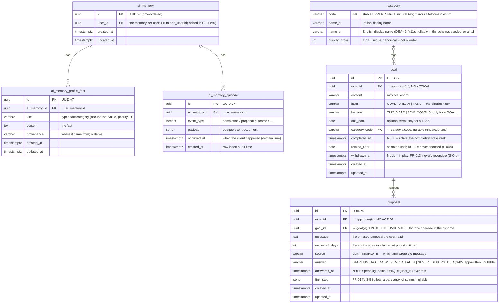

# Data Model

Living data-model doc for 2do AI. Designed **before** the migration that implements
it (design-first). Future slices extend this file as they add tables. Schema is owned
by **Flyway** (`backend/src/main/resources/db/migration`); Hibernate runs
`ddl-auto=validate` and never alters it.

## Entity-Relationship Diagram

`category` is the reference table from the persistence baseline (F-01). It is **reference
data** — the 11 fixed life domains (FR-007), seeded by migration and never edited at
runtime in the MVP. It uses a stable natural key (`code`) rather than a surrogate PK
because the code is the identity the AI auto-tag layer (FR-008) classifies into.

The **AI-memory aggregate** (F-02, Flyway `V3`) is the first domain aggregate, so it is
also the first use of the UUID v7 surrogate-PK + `timestamptz` audit-column conventions
below. `ai_memory` is the root (one row per user); it owns a **semantic profile**
(`ai_memory_profile_fact` — durable typed facts) and a bounded **episodic log**
(`ai_memory_episode` — completions and proposal outcomes, generic `event_type` + `jsonb`
payload). Both layers are rendered and injected into the proposal prompt (S-04); episodic
rows are never deleted (the "last N" cap is a render-time concern), which also leaves them
as the seam for a post-MVP RAG extension.

> **FK (realized in S-01):** `ai_memory.user_id` was an unconstrained, unique UUID column
> in F-02 (`V3`); **S-01** (`account-and-auth`) creates the `app_user` table (`V4`) and adds
> the FK `ai_memory.user_id → app_user(id)` via an expand-only `ALTER` (`V5`). The table is
> `app_user`, not `user` — `user` is a reserved word in Postgres. There is **no
> `ON DELETE CASCADE`**: FR-019 account deletion is app-orchestrated, and the plain FK is the
> DB backstop that makes an out-of-order delete fail loudly. The `UNIQUE` constraint still
> enforces one memory per user.

**`goal`** (S-02, Flyway `V6`; widened by S-07 in `V7` and by S-04b in `V8`) holds **all three** layers — long-term
goals (FR-004), someday dreams (FR-005) and current tasks (FR-003) — in one table,
discriminated by `layer`. One aggregate rather than parallel tables was decided on 2026-08-17
and extended on 2026-08-24: S-04/S-05/S-08/S-09/S-10 all consume the union, and nothing but the
two time fields differs. Which one an entry may carry follows from its layer —

| layer   | `horizon` | `due_date` |
| ------- | --------- | ---------- |
| `GOAL`  | required  | forbidden  |
| `DREAM` | forbidden | forbidden  |
| `TASK`  | forbidden | optional   |

— and that one rule is enforced at three depths: the request DTOs (→ 422), the aggregate
constructor, and the DB constraint `chk_goal_layer_time_fields`, widened and renamed in `V7` and bypassable by
no future writer. Splitting a `task` aggregate out waits until tasks get a different lifecycle
(recurrence, overdue alarms); it would then be a migration, not a rewrite. `completed_at` **is** the
completion state (null = active); a timestamp rather than a boolean because S-03's memory
enrichment needs to know when, not merely whether. `category_code` is nullable: an entry may
stay uncategorized, and S-09's auto-tag only ever fills it in. Like `ai_memory.user_id`, the
FK to `app_user` is deliberately **not** `ON DELETE CASCADE` — FR-019 deletion is
app-orchestrated (`GoalDataDeleter`) and the plain FK is the backstop.

S-04b (`V8`) adds the two columns above and the **`proposal`** table. The split between them is
the whole reason `proposal` is its own aggregate rather than more columns on `goal`: `ProposalSelector`
reads `goal.updated_at` as *"when the user last engaged with this"*, so anything the machine writes on
its own — the phrased message, the frozen `neglected_days`, the generated `first_step` — would silently
reset the neglect clock if it landed there. It lives on `proposal` instead. `remind_after` and
`withdrawn_at` are the exceptions that prove the rule: a snooze and a withdrawal are things the *user*
asked for, so stamping the `goal` row is honest.

Three schema decisions sit on `proposal`; the first two carry product rules a service check could
not hold, and the third backstops the pair of columns the first one reads:

- **FR-018 (at most one pending proposal) is a partial unique index**, `idx_proposal_one_pending ON
  proposal (user_id) WHERE answered_at IS NULL`. A service-level "does this user already have one?"
  races with itself on a double-click and stores both; the index cannot. Answered rows accumulate
  freely — only the pending slot is exclusive.
- **`proposal.goal_id` is the one `ON DELETE CASCADE` in this schema**, so `DELETE /api/goals/{id}`
  keeps working while a proposal points at the entry. The cost is named rather than hidden, and it is
  charged twice. Because `GoalDataDeleter` runs during FR-019 account deletion and every proposal has
  a goal, the cascade erases a user's proposals whether or not `ProposalDataDeleter` exists — so the
  "a missing deleter fails loudly on the FK" property does **not** protect this table, and the
  erasure is asserted directly in `AccountDeletionIntegrationTest` instead. The second cost is
  ordering: both deleters run in one transaction in an unspecified order, so the cascade can remove
  rows an entity delete has already loaded, leaving it to fail on a row count of zero. That is why
  `ProposalRepository.deleteByUserId` is a bulk delete — immediate, and order-independent.
- **`CHECK ((answer IS NULL) = (answered_at IS NULL))`** keeps the answer's two columns whole. The
  aggregate already writes them together, but the pending index above reads only `answered_at`, so a
  row carrying an answer with no moment attached would occupy the FR-018 slot for good while every
  reader called it answered. The constraint is what holds for a fixture, a backfill or a later
  migration that never goes through the aggregate.

`remind_after` is a `DATE` compared against the user's local date, exactly as `due_date` already is:
a snooze is "come back on Thursday", not a moment in a timezone. `first_step` follows
`ai_memory_episode.payload` — `jsonb` mapped from a raw JSON `String`, which keeps the entity free of
any Jackson coupling.

S-05 (`V9`) adds **one nullable column and one enum value**, and the restraint is the design.
`app_user.next_proposal_at` (`timestamptz`) records when each account is next returned to, and
`proposal.answer` gains `SUPERSEDED`.

`next_proposal_at` is deliberately **not** the schedule. `ProposalScheduler` holds that in memory and
compares it against the clock every 60 seconds; a column read on a timer is precisely the metered-idle
cost Neon punishes — the compute would stay awake permanently for roughly one fire per 2-7 days (see
`lessons.md`). The column is the map's *backup*: written once per fire and once when an account's
address is proved, read once per boot, so a deploy resumes each account's own moment instead of
redrawing every one of them into a single bunch. It is written by a targeted `update ... where id = ?` rather than by saving a loaded
`User`, because a fire holds its account detached across the model call — merging one back would
re-insert an account deleted while the fire was in flight, undoing an FR-019 erasure. The update
matching no row is also how the scheduler learns to drop the entry from its map.
The database is therefore touched three times in the whole cycle — boot, verification, and an actual
fire — and never by the tick itself. **Verification, not registration** (DEV-51):
`ProposalScheduler.scheduleNewAccount` listens for `UserVerified`, the boot pass skips rows whose
`email_verified_at` is null, and `scheduleNextProposalAt` carries `and u.emailVerifiedAt is not null`
in its `where` clause — so a registration writes this column never, and the one loop that mails
without being asked only ever holds addresses somebody has proved.

Two consequences follow from that and are worth stating, because both are the kind of thing a later
reader would otherwise assume the other way:

- **`NULL` is a meaningful state, not missing data.** It means "never scheduled", which is what every
  account predating this slice is; the boot pass converts each one into a first drawn moment. That is
  also why the column is nullable rather than defaulted — a default would have to invent a moment at
  migration time for every existing row, bunching them.
- **It is a backup, not a lease.** It presumes the single machine `fly.toml` pins. Two schedulers
  over one column would each fire for every account, since nothing here claims a row. Horizontal
  scaling is the revisit trigger, and it would need a lease column or an external scheduler, not a
  bigger version of this one.

`SUPERSEDED` is the app's own closure of a proposal the user never answered, written when the next
cycle replaces it. It is a distinct value rather than a reuse of `NOT_NOW` — and a distinct memory
episode — because the next prompt has to tell "they said not now" from "they said nothing at all".
The `CHECK ((answer IS NULL) = (answered_at IS NULL))` above covers it unchanged: superseding fills
both columns, which is also what frees the FR-018 pending slot before the replacement is inserted.

DEV-49 (`V10`, `V11`) adds **two nullable columns and no table** — `app_user.preferred_language` and
`category.name_en`. Both are expand-only, neither rewrites an existing row, and the section below
records why each is a column rather than the table or catalog it could have been. Only `name_en`
shows up in the diagram at the top of this file: `app_user` has never been drawn there (it arrived in
`V4`, after this diagram, and the other tables reference it in column comments), so its columns live
in the prose here and in `data-model-current.drawio`, the same way `next_proposal_at` does.

DEV-51 (`V13`, `V14`) adds **four columns, one `CHECK` and no table**, all on `app_user`, and they are the whole of
address verification: `email_verified_at` (`timestamptz`), `verification_code_hash` (`VARCHAR(255)`),
`verification_expires_at` (`timestamptz`) and `verification_attempts` (`INTEGER NOT NULL DEFAULT 0`).
Like `app_user`'s other columns they are not in the diagram at the top of this file — they live in
this prose and in `data-model-current.drawio`.

There is at most one code outstanding per account, it dies with the account, and it is read on
exactly the paths that already load the row (login, verify, resend), so a `pending_verification`
table would buy a join and a second lifetime to keep in step for a value that never outlives the row
it belongs to. `email_verified_at` is a moment rather than a boolean for the reason `completed_at`
is: "when" answers "whether" and additionally says how long an account sat unproved, which is what a
cleanup of dead sign-ups would key on if one is ever wanted. `verification_code_hash` is 255
characters because it holds the same `PasswordEncoder` output `password_hash` does — the code itself
is never stored — and it is cleared together with `verification_expires_at` when a code is spent, so
no code can be replayed. All four move only through targeted `@Modifying` updates on
`UserRepository` (`issueVerificationCode`, `recordFailedVerificationAttempt`, `markEmailVerified`),
the same rule `next_proposal_at` and `preferred_language` follow — and all three carry
`and u.emailVerifiedAt is null` in the `where` clause rather than in the caller, so a proved account
can neither be handed a code nor charged a guess by a request racing the write that proved it.

Two things about this migration are different from the nullable columns above, and both are
load-bearing:

- **`verification_attempts` is `NOT NULL`, and is only safe because of its `DEFAULT 0`.** The
  currently deployed image inserts `app_user` rows without naming the column — exactly the
  distinction `V12` drew when it argued the same move was safe on `category` (written by migrations
  alone) and would not have been on a table the running application writes.
- **The backfill is not optional.** `NULL` here means "never proved", so shipping the columns without
  `UPDATE app_user SET email_verified_at = created_at WHERE email_verified_at IS NULL` would lock
  every existing account out of its own app on the deploy that applied it. With it, existing accounts
  are verified as of the moment they were created and notice nothing.

Expand-only otherwise: under an image rollback the columns are simply never read, and the previous
image sends no codes either. The one asymmetry is worth recording, because it is the only way this
change can bite an operator — an account created under the new image and never verified becomes a
*live* account under a rolled-back one, so a rollback means deleting unverified rows by hand first
(deployment runbook, phase 8).

`V14` follows it with the pairing `V13` left to convention: `CHECK ((verification_code_hash IS NULL)
= (verification_expires_at IS NULL))`, named `verification_code_pairing`. The two columns are one
fact — written together by `issueVerificationCode` and cleared together by `markEmailVerified` — but
they were independently nullable, so a half-written pair was a latent NPE on the read that null-checks
the hash and then dereferences the expiry (`User.hasCodeAwaiting`). It is the same backstop
`proposal`'s `CHECK ((answer IS NULL) = (answered_at IS NULL))` is, and safe for a reason worth
repeating: every row today has both columns null or both set, so the constraint validates without
rewriting anything, and a rolled-back image writes the same pairs this one does. Hibernate's
`ddl-auto=validate` ignores `CHECK` constraints, so no mapping moved with it.

### Internationalization

The **language-neutral identity is `code`**, never the label. All domain and AI logic
keys off `code` (= the `LifeDomain` enum) and `display_order`; the `name_*` columns are *purely
display labels* that nothing functional reads. The explicit locale suffix documents the locale
assumption rather than hiding it behind a bare `name`.

**DEV-49 took the first of the three paths this section used to offer** — `name_en` as a second
column (`V11`), one expand-only migration and no joins — and left the other two unbuilt. The set is
eleven rows fixed by `V1`/`V2` and owned by a Flyway seed, so a
`category_translation(category_code, locale, name)` table would buy a join and a migration per
locale to model a list that cannot grow at runtime, and moving the labels into message catalogs
would leave half the reference table in the JAR and half in Postgres while `CategorySyncCheck`
guards only the half in Postgres. Both remain reachable for the original reason: `code` is the
identity, so neither is a destructive migration. The column is nullable with no `DEFAULT` so an
image rollback is safe — the previous image reads `name_pl` and never looks at it — which also
means nothing in the schema guarantees the seed ran, and
`CategorySeedTest.everyEnglishNameIsNonBlank` is what does.

Which column fills the wire's `name` is decided **per request from `Accept-Language`**, not per
account: `CategoryController` builds one immutable collection per `AppLanguage` at startup and picks
between them, and answers `Vary: Accept-Language` so a cache cannot hand the Polish response to a
caller who asked for English. Nothing on the wire was renamed — `CategoryResponse.name` was already
spelled for its role ("the label for this caller"), which is why the second language landed without
a client change.

**The account's own language is the other half, and it is a column rather than a header.**
`app_user.preferred_language` (`V10`, `VARCHAR(2)`) holds the `AppLanguage` name — `PL` or `EN`, not
a BCP 47 tag, because there are two locales and no region variants. `Accept-Language` answers "what
should *this* response be rendered in" and cannot answer "what language does this account read" at a
moment when no request exists, which is exactly what the natural-rhythm e-mail needs at send time
(FR-009) and what the SPA seeds itself from at login. The column is moved by a targeted
`update ... where id = ?` (`UserSettingsService.changeLanguage`), for the same reason
`next_proposal_at` is: `User` keeps having no setters, and no call site is one `save` away from
re-inserting an account FR-019 erased.

`NULL` is a meaningful state here too, and it does **not** mean what the enum's own default means.
A *request* naming no language the app speaks resolves to English, because the app is English-first
(`AppLanguage.DEFAULT`); an *account* that never chose reads as Polish, because it predates the
question being asked (`User.getLanguage()`). That null **is** the FR-004 backfill — every account
created before `V10` keeps reading Polish without a row being rewritten and without ever being
prompted — which is why the column is nullable with no `DEFAULT`, exactly like `next_proposal_at`.
Collapsing the two rules into one constant would flip the existing account to English on its next
login.

## Conventions

Every later slice inherits these rules (also recorded in `CLAUDE.md`):

- **Domain aggregates** (User, Goal — one aggregate covering the goal, dream and task layers,
  CurrentTask, AI-memory, …) use a **UUID v7**
  surrogate primary key, generated via Hibernate `@UuidGenerator`
  (RFC 9562, `UuidVersion7Strategy` — time-ordered, index-friendly).
- **Audit columns**: every domain table carries `created_at` and `updated_at` of type
  `timestamptz`.
- **Reference tables** (like `category`) may instead use a **stable natural key** and
  omit audit columns, since the data is static and versioned by migration.
- **Columns are `snake_case`**; Java fields map to them (`name_pl` ↔ `namePl`).
- **Migrations are expand-only** in spirit (backward-compatible create/insert), so an
  image rollback never strands the schema. Destructive changes follow expand/contract.

## Planned (not yet designed)

No table is currently waiting to be designed. Later slices add theirs here; each will
reference `category.code` where it needs a life domain.

> The AI-memory tables (`ai_memory`, `ai_memory_profile_fact`, `ai_memory_episode`) were
> in this list until F-02; they are now drawn above. So was **`app_user`**, until S-01
> shipped it in `V4`/`V5`. So were **`goal`** and **`dream`**, listed as two tables before
> the schema was designed — S-02 settled on a single `goal` table with a `layer`
> discriminator, drawn above. So was **`current_task`**, until S-07: rather than a fourth
> table it became a third `layer` value plus a nullable `due_date` on that same `goal`.
> So was **`proposal`**, until S-04b drew it above — the proactive loop needed somewhere for
> FR-018's at-most-one-pending rule to be true, and for a second press of the button to return the
> same proposal rather than pay for a second model call.
> The target diagram keeps a ghosted `task` box as the escape hatch, not as planned work —
> the split earns its keep only once tasks get their own lifecycle (recurrence, overdue
> alarms), and it is then a migration rather than a rewrite.
