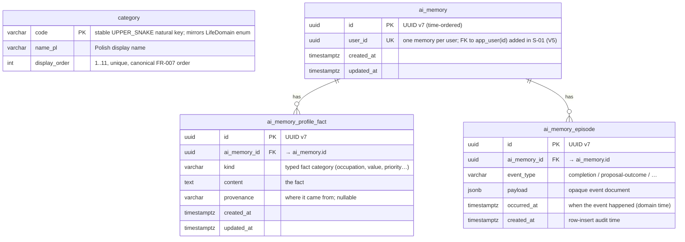

# Data Model

Living data-model doc for 2do AI. Designed **before** the migration that implements
it (design-first). Future slices extend this file as they add tables. Schema is owned
by **Flyway** (`backend/src/main/resources/db/migration`); Hibernate runs
`ddl-auto=validate` and never alters it.

## Entity-Relationship Diagram

`category` is the reference table from the persistence baseline (F-01). It is **reference
data** — the 11 fixed life domains (FR-007), seeded by migration and never edited at
runtime in the MVP. It uses a stable natural key (`code`) rather than a surrogate PK
because the code is the identity the AI auto-tag layer (FR-008) classifies into.

The **AI-memory aggregate** (F-02, Flyway `V3`) is the first domain aggregate, so it is
also the first use of the UUID v7 surrogate-PK + `timestamptz` audit-column conventions
below. `ai_memory` is the root (one row per user); it owns a **semantic profile**
(`ai_memory_profile_fact` — durable typed facts) and a bounded **episodic log**
(`ai_memory_episode` — completions and proposal outcomes, generic `event_type` + `jsonb`
payload). Both layers are rendered and injected into the proposal prompt (S-04); episodic
rows are never deleted (the "last N" cap is a render-time concern), which also leaves them
as the seam for a post-MVP RAG extension.

> **FK (realized in S-01):** `ai_memory.user_id` was an unconstrained, unique UUID column
> in F-02 (`V3`); **S-01** (`account-and-auth`) creates the `app_user` table (`V4`) and adds
> the FK `ai_memory.user_id → app_user(id)` via an expand-only `ALTER` (`V5`). The table is
> `app_user`, not `user` — `user` is a reserved word in Postgres. There is **no
> `ON DELETE CASCADE`**: FR-019 account deletion is app-orchestrated, and the plain FK is the
> DB backstop that makes an out-of-order delete fail loudly. The `UNIQUE` constraint still
> enforces one memory per user.

### Internationalization

The **language-neutral identity is `code`**, never the label. All domain and AI logic
keys off `code` (= the `LifeDomain` enum) and `display_order`; `name_pl` is *purely a
display label* that nothing functional reads. The explicit `_pl` suffix documents the
locale assumption rather than hiding it behind a bare `name`.

The MVP is Polish-only (single user), so we store one label and stop there (YAGNI).
Adding a language later never touches identity or behavior and is always **expand-only**
(backward-compatible). When a second language is genuinely needed, pick by how many
locales we expect to support:

- **A few fixed languages (PL + EN):** add a `name_en` column — one expand-only
  migration, no joins.
- **Many/growing locales, or a translator workflow:** add a
  `category_translation(category_code, locale, name)` table (locales become data, not
  schema).
- **Adopting i18n tooling anyway:** move labels out of the DB into message catalogs
  keyed by `code`; the table then keeps only `code` + `display_order`. Arguably the
  cleanest for pure display strings.

Because `code` is the identity, any of these is reachable without a destructive
migration.

## Conventions

Every later slice inherits these rules (also recorded in `CLAUDE.md`):

- **Domain aggregates** (User, Goal, Dream, CurrentTask, AI-memory, …) use a **UUID v7**
  surrogate primary key, generated via Hibernate `@UuidGenerator`
  (RFC 9562, `UuidVersion7Strategy` — time-ordered, index-friendly).
- **Audit columns**: every domain table carries `created_at` and `updated_at` of type
  `timestamptz`.
- **Reference tables** (like `category`) may instead use a **stable natural key** and
  omit audit columns, since the data is static and versioned by migration.
- **Columns are `snake_case`**; Java fields map to them (`name_pl` ↔ `namePl`).
- **Migrations are expand-only** in spirit (backward-compatible create/insert), so an
  image rollback never strands the schema. Destructive changes follow expand/contract.

## Planned (not yet designed)

These tables arrive with later slices and are intentionally **not drawn** here yet, to
avoid pre-deciding their schema:

- **`app_user`** and auth-related tables — S-01 (`account-and-auth`). (`app_user`, not
  `user` — reserved word in Postgres.)
- **`goal`**, **`dream`** — S-02 (`goals-and-dreams`).
- **`current_task`** — S-07.

Each will reference `category.code` where it needs a life domain.

> The AI-memory tables (`ai_memory`, `ai_memory_profile_fact`, `ai_memory_episode`) were
> in this list until F-02; they are now drawn above.
